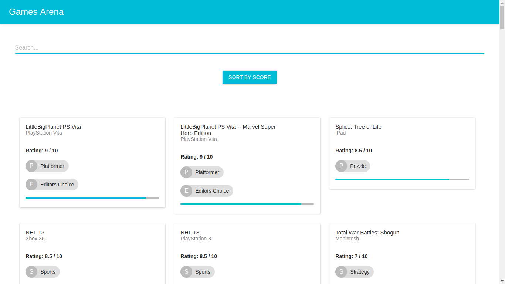
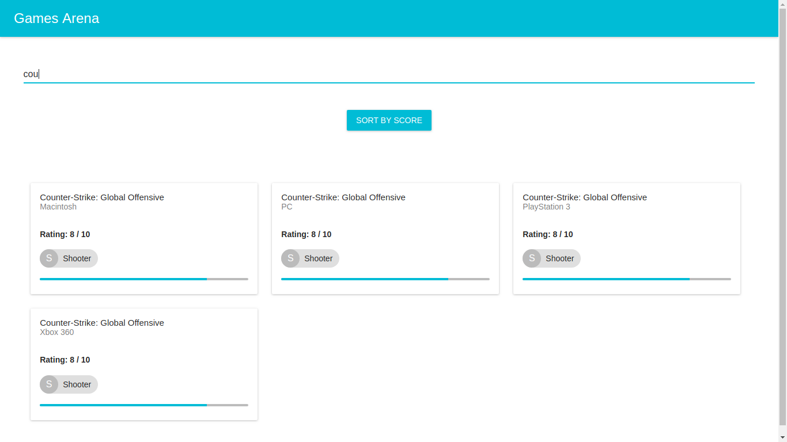
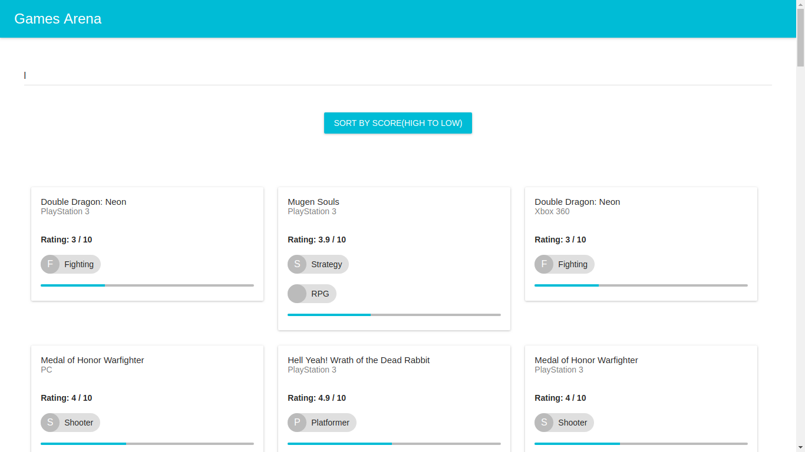
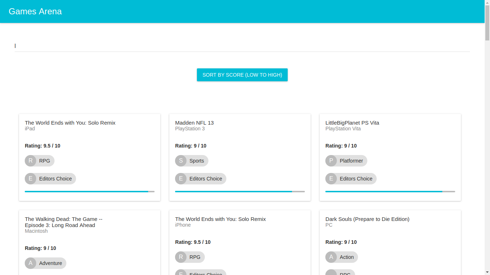
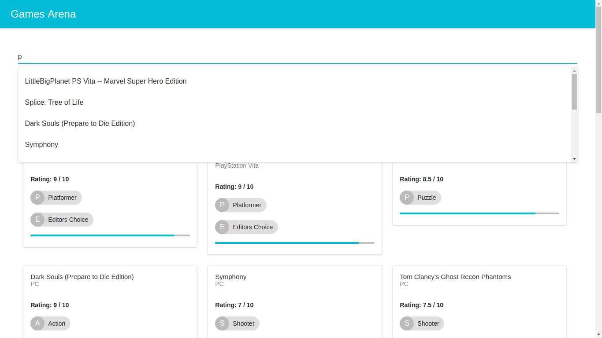

# Games-Arena | Cogoport Frontend Developer Hiring Challenge
Develop a pseudo front end application which would let the users help list and browse games developed for different platforms conveniently.

## How to run the project online
Open the online demo [here](https://github.com/sACHIN34212/Games-Rentomojo-sachinPaswan)

## Features

- Use of Web API to fetch games details.
- Visually interactive responsive design listing all the games.
- Submit Screenshot, Source code & Instructions.
- A feature to Search (via name).
- Implement Sort feature (to filter through ‘score’ in ascending and descending order).
- Add autocomplete feature to Search games conveniently .
- Custom elegant design, fonts and icons to make web app more user-friendly.
- Use your imagination and add features which would make things easier for end users.

## Screenshots
Project Home Page

Search Feature

Sort by score (Low to high)

Sort by score (high to low)

Suggestions

